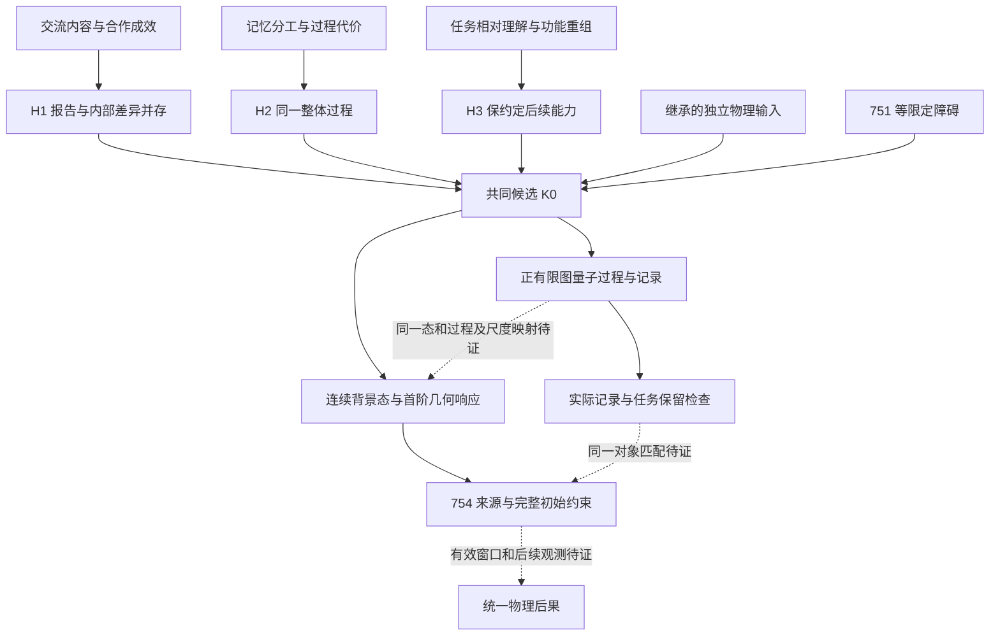

# 工作报告：由认知观察筛选共同候选，并收拢后续检验

日期：2026-10-04。接[751假说与障碍分类](../../751/drafts/joint_hypothesis_obstacle_review.md)、[754研究报告](../../research_note_754.md)和[754条件总账](../../754/unified_physics_condition_ledger_754.md)。本报告落实用户授权转达的两项方法提醒：认知观察先参与选题；每项检验服务于共同候选的收拢。**这是工作报告，不是完成第755轮，不增加科学检查数，不修改应用目标。** 历史文件与冻结入口保留。

## 1. 当前判断与执行改变

已有进展主要是把同一原作用中的物质、参考、来源和经典约束接通；完整量子过程、物理态及共同尺度尚未接通。若每遇到一个技术缺口就无限延伸其局部计算，确实会形成方法上的瓶颈。认知假说现在就可以参与选择和舍弃方案，不须等其从FUCP推出。

认知假说的价值须体现为可检验限制：它排除了哪种组织或连接方式，保留哪些替代方案，是否同时限制多个部门。把计算完成后的一句“这像认知”移到开头，仍不够。以下沿用751的三条假说，补齐观察、替代解释、数学要求和适用范围；没有额外堆叠一套基本公理。

本次回读采用“总账覆盖＋关键证据定位”：751—754；708、724；604及总账保留的649/699；382—386、425、522—523的既有接口表。未声称重新逐字审查全部754轮，也没有重复运行全部历史实验。

## 2. 观察材料：可以启发结构，不能直接证明宇宙性质

这里把原始研究中的观察与本项目的推广分开。文献只支持表中的人类任务，不为量子、引力或普遍认知公理背书。

|认知材料及证据类型|观察到的有限事实|本项目可提炼的性质|替代解释及适用边界|
|---|---|---|---|
|Bahrami等，2010，双人视觉判断实验|相近敏感度的搭档可从交流中受益；差异大的搭档未必优于更好的一人；论文比较了不同信息共享模型|共享最终判断之外的信息，可能改变合作能力；扩大组织不保证自动改善|置信度共享是该任务的一种解释；论文也保留了次优使用更丰富信息的可能。不能推广为每个主体都必须说出置信度，更不等于共享完整内部态|
|Clark与Brennan，1991，沟通协调的理论分析|理解的判据随当前任务变化；媒介改变协调与修复的成本|共同理解可针对具体任务；交互方式和代价不能只从最终句子决定|语言约定、熟练程度和媒介是人类特有因素；这里不把其成本分类转换成能量定律|
|Hutchins，1995，驾驶舱记忆任务分析|速度标记、操作流程和人员一起承担记忆功能；重新组织后，同一功能可由不同过程完成|整体的功能可以分布在不同部件，局部能力与整体功能须分别检验|外部工具也可解释为个人能力的辅助；改变分析边界本身不能证明宇宙认知本体论，也不要求组织在微观结构上精确自相似|

原始来源：[双人判断实验](https://pmc.ncbi.nlm.nih.gov/articles/PMC3371582/)、[沟通协调章节](https://web.stanford.edu/~clark/1990s/Clark%2C%20H.H.%20_%20Brennan%2C%20S.E.%20_Grounding%20in%20communication_%201991.pdf)、[驾驶舱记忆研究](https://pages.ucsd.edu/~c8johnson/COGS102B/Hutchins95.pdf)。本次核读正文文字，不做图像检查。下列H1—H3是本项目从这些材料及用户认知本体论主张提出的推广，不是文献中的物理定理。

## 3. 三条相容工作假说

### H1：共享报告与继续执行任务的内部差异并存

**观察到什么：** 协作可以形成一个共同判断，同时保留不同能力、信息可靠性和后续响应。信息交换方式会影响合作成效。

**提炼什么：** 对一个指定任务，共同报告可以是一份摘要；整体还须保存完成约定后续任务所需的内部状态及关联。允许有损摘要，也允许某些任务只需报告。这里不要求两主体拥有同样的全部知识。

**数学要求：** 声明输入态族、任务族、报告通道与继续演化的输出对象。报告相同的输入，若后续合法任务仍能区分，则不得在共同模型里无条件等同。报告R、未公开资料Q、资源A是功能角色；在受规范约束体系内，不能因此假设三个独立张量因子或直接复制任意量子态。

**替代分支：** 纯经典潜变量也可能实现这条功能要求；指定任务上报告可能已经充分；量子方案则可保非对易的未共享资料。采用量子方案的依据仍来自前阶段的明确条件定理，不由置信度、默契或集体智慧直接推出复数。

**共同限制与已有证据：** C01量子对象、C03记录、C19参考、C21存储、C22来源。751排除了原任务中的“报告足以决定全部来源”；742—746限制了某些实现类并给原相互作用的记录能力。H1不选择维数、规范群、物种和Einstein作用。

**失败判据：** 某个具体摘要声称保一组后续任务，却有两个允许输入经摘要等同、任务输出差异超过事先误差界。反例只排除该摘要与合同，不自动排除H1或全部认知假说。

### H2：准备、交互、记录与补偿属于同一整体过程

**观察到什么：** 相同的协作结果可以经过不同沟通、修复和工具使用过程；记忆或计算负担可在成员和工具之间转移。

**提炼什么：** 对封闭候选，记录的形成及其后果应有共同过程来源，不能把未交代的代价藏到系统外。这一“整体内部交代”要求还使用用户的认知本体论主张；它不是从驾驶舱案例推出的宇宙闭合定理。

**数学要求：** 同一准备、演化和记录过程同时决定概率、后态与完整资源变化。若接物理模型，各来源须由同一对象及同一变分约定给出，内部转移和边界通量一起计入。使用外部控制的子系统模型仍允许，但整体账必须指认控制载体及当前尚未构造的部分。不能仅以平均能量守恒替代全部约束和量子正性。

**替代分支：** 显式纳入控制系统；保留装置与被测对象的相互作用；有限精度实现；或在声明的有效范围中用外部装置近似，并承认该范围尚非封闭整体。持续相互作用不必还原为端点完全解耦的精确理想测量。

**共同限制与已有证据：** C03/C04/C09/C11/C22。593、634、750、751限制漏来源、倒改过去和端点可加的若干接法。753/754使原规范场能承担新颜色源的补偿，并同时满足经典初始约束。这尚不是补偿动作由内部过程自主产生的证明。

**失败判据：** 同一声称完成的协议必须另选不一致的准备或来源；概率不归一；补偿破坏其余约束；或者有限资源范围内无法实现所承诺任务。不得因发现一种补偿方法失败就宣称所有闭合过程不可能。

### H3：扩大或压缩组织时，保留声明的继续认知能力

**观察到什么：** 记忆可以由个人转为人员与工具的共同功能；共同理解只需达到当前任务要求；合作也会失败，不能假定组织扩大必然增加能力。

**提炼什么：** 所谓“更大的认知结构”，应通过它还能执行哪些任务来判定。功能可以重新分工；不要求每一级结构和全部微观状态一模一样。允许增加任务，但须明确新能力从哪里来、付出什么。

**数学要求：** 在原模型声明态族、有限任务历史、分辨率与资源范围，给出粗化/嵌入映射及任务输送。在这份范围内比较联合报告概率、约定后态和来源。无界能源或来源另需相应矩、域或加权范数控制，不能从报告的总变差小推出来源也小。动态闭合必须另验，静态摘要保留不够。

**替代分支：** 精确保一个真子代数；带记忆的有效过程；声明误差的近似粗化；保留更丰富的完整状态。原则不要求选定某一种，也不要求任意小有限摘要能精确保所有未来。

**共同限制与已有证据：** C02区域、C03记录、C20尺度、C21存储、C22来源。708同一二次资料连接读口成本与质量耦合；709保指定任务的真子代数；724把同次记录选区与规范拼接接通；749排除直接平均指定几何初值。已知结论直接复用。

**失败判据：** 合并后丢掉事先要求的任务或来源；嵌套映射互不相容；为维持声称误差所需资源在声明范围内失控。失败可要求保留记忆或缩小适用范围；不得无说明把全部微观信息重新定义为必须保留，以使假说不可检验。

## 4. 收拢为一个候选说明，而不是拼成已经完成的理论

候选K0采用H1＋H2＋H3，保留原共同作用与物种，优先让同一物质、内部参考、记录和来源共同工作。主体先按记录和任务分工识别；不另添一种“认知粒子”。认知功能角色不预设物理空间维数。

|候选部件|当前固定选择|证据强度与缺口|
|---|---|---|
|物质与相互作用|沿既有规范、Higgs/singlet、Dirac/Majorana和引力作用字典；不为下一轮加入752新窗口作用|是继承物理输入，未由H1—H3唯一推出|
|共同背景|753/754原非零颜色在壳背景及其小变化；h、s及原导数标签作为已有局部参考|经典约束及局部参考已证；背景选择与初值仍输入|
|量子整体与报告|采用原正有限图过程及其合法Gauss态、实际记录作为Q方案的已有部件|固定图有实际量子对象；未等同为连续手征场或引力量子物理态|
|连续来源与有效几何|730—741及754的同背景Hadamard态、共同来源、短时首阶反作用|作为E方案的受控阶次部件；不是已从Q方案导出的有效极限，也非任意未知输入的精确确定反馈|
|区域与尺度|优先复用724实际记录选区，708/709指定任务保留与704/706有限过程极限|任务和范围明确；共同空间细化及动态图物理极限仍开放|
|空间接口|复用382—386或425的条件路线，522/523已有资源和方向仪器连接|需当前共同物质过程的对象映射；不重加384已消去的Lipschitz，386与425不强行叠加|

Q与E在这里是K0的两个拟连接描述层，**不是已经证明等价的两种表示**。它们之间的态、过程、尺度映射是核心待验接口。若最终采用独立的量子—经典混合动力学，那是需明确登记的新候选分支，不能默认为K0已经包含。

当前只保一个优先组合与两种备用处理：主组合保存完整内部关联及原实际相互作用；若有限范围上需有效描述，明确加入记忆/噪声及误差；若所选组合不相容，修订假说实现或物理输入。不要同时把所有备用补丁加入主模型。

## 5. 假说—障碍—模型—物理连接图

箭头表示本报告的依赖和待验关系；虚线不是已证蕴涵。图使用文本，不需生成或检验图像。

不得把图中“独立物理输入”擦掉后再称认知假说已推出这些输入。图中实线到已有部件也只表示组合及检验关系，不能理解成H1—H3已单独证明这些部件的存在。

## 6. 截至754的净收益与剩余输入

|单元|关闭、排除或保留了什么|是否减少独立输入|
|---|---|---|
|708/709/724|指定继续任务、实际区域记录、来源保留有共同约束；不允许随意只留均值|限制摘要和映射的选择，未选择现实维数或全部作用|
|749—751|排除直接平均特定几何初值、逐分支改过去拼概率、仅报告定源，以及一个精确测量实现类|排除组合；没有由此推出新的唯一动力学|
|752|指定局部窗口作用若保两个径向精确共同主锥，只许A/B仿射；排除其非零四标签紧支撑接法|限定新增耦合的函数形式；K0暂不采用该新增作用，所以未把该分类计成K0已减少的参数|
|753|原作用内找到全经典约束、原参考和无连续联合稳定子的共同背景；另保原零色不可积反例|无需新物种/作用项；选哪个背景仍是输入|
|754|同一非零颜色背景承接非零均值的真实态差来源；完整补偿与初始约束及条件首阶发展相接|去掉旧零色背景的八个附加均值相容限制；没有减少规范群、维数或引力作用的独立输入|

仍独立的核心输入按四包管理，详细条目沿754总账，不再每遇一个细节就新开方向：

1. **物理结构包：** 原维数/Lorentz与光滑背景、规范群及手征表示、引力和物质作用及耦合。H1—H3尚未共同选择它们。
2. **量子与尺度包：** 正则化、物理内积/约束态、重整化约定、原图到连续物种及来源的同一映射。604、649、699分别保其限定失败范围。
3. **准备与过程包：** 参考态、允许输入、原实际仪器及其自主实现、资源状态和关系参考的输送。背景态存在不等于已内部制备。
4. **有效性与观测包：** 有效时间/能量/分辨率、近似误差、宇宙初边值和可观测参数。O(ε²)方程残差不等于ε=1时解误差受控。

“减少输入”至少要给同一适用范围内的蕴涵或等价映射；把若干参数合称为一条大公理，或者把新任务要求改名为认知定义，不计减少。

## 7. 下一项的有限验收：先检查同一对象，再进入新的技术证明

第755轮冻结入口继续保留，本工作报告细化其执行顺序。**下一项只围绕一个问题：K0中承担报告与内部来源的同一物理过程，能否接到754的受约束背景响应，而不在中途更换态、概率或来源？** 不先拆成“再优化一个读口”“再换一个背景”“再做一个来源逆”的独立支线。

先制作一份共同对象证书，固定：允许态族、准备和实际相互作用、一个有限记录任务、完整后态、全部来源、补偿资料、适用阶次及误差。每个箭头注明已有定理或新证明；如果仅有背景CAR而无全量子物理态，证书只能验收到明确的背景场/首阶有效范围。

该证书有三种合法结论：

- **连接成立：** 在已声明范围中，同一非平凡任务、来源和约束由共同对象承担。给解析连接、可复算检查及所减少的独立条件，再形成编号研究报告。
- **指定组合失败：** 给满足所列输入却破坏一项合同的反例，明确只排除这个组合。比较H1—H3预先保留的替代分支，不无限添加免费装置。
- **证据不足：** 若只整理出Q→E关键映射仍缺，记录在工作报告，编号停在754；列出一个能区分候选的下一检验。未完成证明不冒充全局反证，也不把整理凑成755。

748总信号的严格符号、局部颜色逆常数优化、任意新来源函数、所有理想仪器的普遍自治实现，当前不自动升级为前置。若选定任务确实依赖其中一项，再说明依赖后处理。完整物理态、概率正性和同一来源则属于核心资格，不能为宣称统一而略过。

每项后继研究开头须交代：**哪项认知观察选择了该问题；采用哪条假说及替代分支；本项将关闭哪个共同接口、排除哪个组合或减少哪个条件。** 收尾对照这三项，不以运行次数和文档数量代替进展。

## 8. 目标与阶段边界

总目标“认知本体论与现代物理的统一模型”保持。用户尚未授权此次修改应用目标，本报告不调用目标修改或定时工具。

近期按上述共同候选的相容性和充分性检验推进；这不要求先证明三条假说对一切认知必然，也不把3+1、Einstein方程或标准模型群写进认知假说再回称推导。即使阶段相容性成立，独立物理输入、预测及与实验的比较仍单列。

正式最新科学轮次仍为754；本报告、链接核验和文献核读不新增科学实验数。后继归档时须保留本版及核验记录，不覆盖冻结历史。
