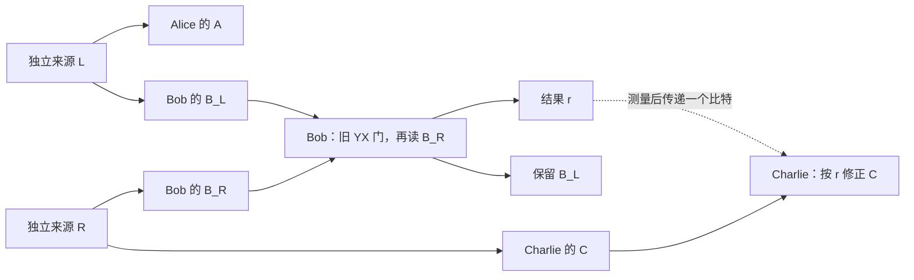

# 第六十二轮：两个独立实来源能够通过中间主体对齐参考

日期：2026-09-15。接续第 61 轮提出的两源、三主体任务。

## 1 先给结论与资源条件

**来源在准备时独立，不代表之后永远不能形成共同参考。** 两份独立的旧实参考态，经过中间主体的一次旧共同门与噪声读取，再把一个结果比特传给末端进行旧实修正，就能形成接近第 60 轮三方参考的状态。

本轮没有后选择，两个结果都保留。一次原读取造成的参考迹距离误差为 (1−α)/2≈0.00519208149。共同参考不是免费出现的：来源准备后允许中间主体比较两个输入，并允许向末端传递测量结果。

来源独立在这里明确采用通常张量积规则，而不是从“局部记录看起来独立”反推出来。矩阵规则、辅助重置和共同流继续是候选模型的输入。

## 2 明确的两源电路

第一源向 A、B_L 发送 τ=(II+YY)/4；第二源向 B_R、C 独立发送相同的 τ。初态为

\[
\Omega=\tau_{AB_L}\otimes\tau_{B_RC}.
\]

Bob 同时持有 B_L、B_R。Alice 与 Charlie 分别持有 A、C。外端初始边缘严格为 I_A/2⊗I_C/2。



具体执行 U_YX(π/2) 作用于 B_L、B_R，然后用原 fresh Z 仪器读取 B_R 并丢弃它。设原读取强度为 η，β=αη，结果 r=±1。

由于旧门将 B_R 的 Z 指针对应到输入的 Y_BL Y_BR，r 测的是两个参考的相对方向，而不是一个孤立系统的新 Y 坐标。

## 3 两个条件态的精确公式

保留系统按 A、B_L、C 排序，简写 B=B_L。两个分支概率都为 1/2，归一化条件态为

\[
\rho_r=\frac18[III+YYI+r\beta(IYY+YIY)].
\]

程序使用完整旧 Kraus 仪器计算，包括原噪声和测后状态，随后做部分迹；不是用理想奇偶投影替代旧仪器。

为看清公式，可将每份 τ 代数上写成 P_+⊗P_+ 与 P_-⊗P_- 的均匀混合。两源方向 a、c 独立且均匀，读取似然为 (1+rβac)/2。条件态对这些分量求和即得上式。P_± 本身不是允许的独立实准备，这个推导只是计算当前全实密度矩阵的便捷展开，不是一般经典隐藏态模型。

更一般地，两源相关分别为 u、v，τ_u=(II+uYY)/4、τ_v=(II+vYY)/4，则

\[
\rho_r(u,v)=\frac18[III+uYYI+r\beta v IYY+r\beta uvYIY].
\]

这保留了来源不完美与探针不完美的不同作用。

## 4 一个可执行的旧实修正

若 r=−1，Charlie 对自己的参考 C 做 X 共轭；若 r=+1，不动。因为 XYX=−Y，两个归一化分支都变为

\[
\rho_{\rm aligned}=\frac18[III+YYI+\beta(IYY+YIY)].
\]

这里没有将孤立反射 X 偷加为连续局部门。Charlie 可以独立重置辅助 D 为 |0〉，在 D、C 上执行原 U_YX(π)：

\[
U_{YX}(\pi)=(-iY)_D\otimes X_C.
\]

丢弃 D 后目标精确接受 X 共轭。这对任意与其他系统相关的目标输入也成立；代码直接验证了整个通道。辅助需要计入，不能说原单系统 SO(2) 自己产生了 X。

令 τ₃^flip 为 τ₃ 在 C 上翻转 Y 方向后的状态，则

\[
\rho_{\rm aligned}=\frac{1+\beta}{2}\tau_3+
\frac{1-\beta}{2}\tau_3^{\rm flip}.
\]

两项支撑正交，所以 D(ρ_aligned,τ₃)=(1−β)/2。对 0≤u,v≤1 的弱来源，距离进一步精确为 1−(1+u)(1+βv)/4。

## 5 忘掉结果为什么不能得到相同的参考

若 Bob 读取后不做远端反馈，也不保留可用的结果标签，则

\[
\tfrac12(\rho_++\rho_-)=\tau_{AB}\otimes I_C/2.
\]

外端 A、C 的边缘仍为 I/4。出现跨两源的条件相关，与不依赖结果的远端相关，是两个不同命题。下一轮会一般性证明这一无信号约束，并检查“事后只处理记录”能做到什么。

## 6 与文献和研究目标的关系

本轮阅读 [Renou 等，Quantum theory based on real numbers can be experimentally falsified](https://arxiv.org/pdf/2101.10873) 的公设段、正文图 2 及对应网络概率公式。论文明确将独立准备表示为张量积，并规定各处测量作用范围。我们的反馈电路改变了结果何时能被远端使用；不能拿它冒充对其受限网络定理的反例。本轮未复现该论文的任意维数排除证明及数值界。

因此本轮得到的是**独立来源允许后续合作时，实参考仍可建立**，没有从认知推出量子理论，也没有证明实理论在所有独立源实验中都能模拟复理论。

实现：[independent_source_alignment.py](independent_source_alignment.py)。结果：[independent_source_alignment_results.json](independent_source_alignment_results.json)。新增 **10 项检查通过**：实际两源张量准备、完整噪声分支、辅助实修正、两个分支合并、来源误差、距离与边缘。

```text
python -X utf8 research_cognition_physics/independent_source_alignment.py --write-results
```
